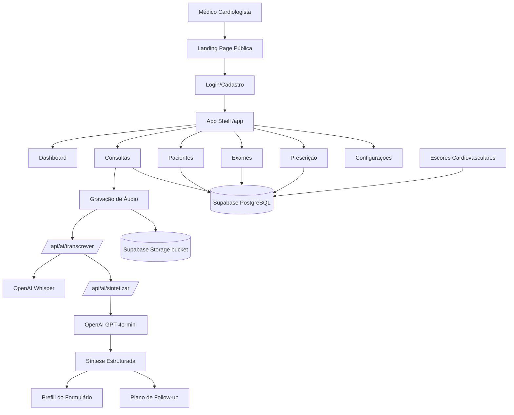

# ARQUITETURA.md — Arquitetura do Sistema

**Projeto:** CardioPront  
**Atualizado em:** 2026-06-28  
**Status:** Desenvolvimento (MVP funcional)  
**Especificação de origem:** `Escopo_Tecnico_Plataforma_Consulta_Medica_IA_Arcane_Tecnologia.md` (Arcane Tecnologia, v1.0, 28/06/2026)

---

## 1. Visão Geral

O CardioPront é um prontuário eletrônico inteligente voltado exclusivamente para **cardiologistas brasileiros**. O sistema substitui papel, PDFs e sistemas genéricos por uma plataforma feita sob medida para cardiologia, oferecendo transcrição por voz, pedidos de exames cardiológicos, prescrição inteligente com alertas de interação e ajuste renal, cálculo de escores cardiovasculares e síntese automática de consultas por IA.

O sistema resolve a dor do cardiologista que precisa registrar consultas de forma estruturada, prescrever com segurança, solicitar exames específicos da especialidade e acompanhar a evolução cardiovascular do paciente — tudo em um só lugar, com conformidade LGPD e CFM 1.821/2007.

---

## 2. Stack Tecnológica Identificada

### Backend
- **Linguagem:** TypeScript (estrito)
- **Framework:** Next.js 15 (App Router, Server Components + Route Handlers)
- **ORM/Cliente de dados:** Supabase JS (`@supabase/supabase-js` v2) — acesso direto via cliente admin
- **Autenticação:** Custom com PBKDF2-SHA256 (210.000 iterações), cookie httpOnly `cp_session`
- **Testes:** Node.js native test runner (`node:test` + `node:assert/strict`) executado via `tsx`

### Frontend
- **Linguagem:** TypeScript
- **Framework:** React 19 (via Next.js 15)
- **UI library:** TailwindCSS 3.4 + Lucide React (ícones)
- **Componentes:** Componentes client-side com `"use client"`, sem biblioteca de UI externa
- **Gráficos:** Chart.js + react-chartjs-2
- **Notificações:** react-hot-toast
- **PDF:** @react-pdf/renderer
- **Validação de formulários:** Zod
- **Datas:** date-fns

### Banco de Dados
- **Banco:** PostgreSQL (via Supabase)
- **ORM / Query Builder:** Supabase JS (sem Prisma client em runtime — `prisma/schema.sql` é referência DDL)
- **Migrations:** Scripts SQL manuais em `supabase/migrations/`
- **Seeds:** Scripts SQL em `prisma/seed-drugs.sql` e `prisma/seed-exams.sql`

### Infraestrutura
- **Docker:** NÃO IDENTIFICADO
- **Deploy:** Vercel (presença de `.vercel/` e `next.config.ts`)
- **CI/CD:** NÃO IDENTIFICADO
- **Observabilidade:** NÃO IDENTIFICADO
- **Storage:** Supabase Storage (bucket `consultation-audio`)

### Integrações Externas
- **OpenAI:** Whisper (transcrição de áudio) + GPT-4o-mini (síntese estruturada de consulta)

---

## 3. Estrutura de Pastas

```text
/
├── prisma/
│   ├── schema.sql              # DDL completo do banco (referência MySQL, aplicado no Supabase/Postgres)
│   ├── seed-drugs.sql          # Seed do catálogo de medicamentos cardiovasculares
│   └── seed-exams.sql          # Seed do catálogo de tipos de exame
├── supabase/
│   └── migrations/
│       ├── 20260628_tighten_medicos_auth_constraints.sql
│       └── 20260628_z_consultation_audio_storage.sql
├── src/
│   ├── app/
│   │   ├── layout.tsx          # Layout raiz (fonte Inter, metadata SEO, SchemaOrg)
│   │   ├── page.tsx            # Landing page pública (marketing)
│   │   ├── globals.css         # Estilos globais Tailwind
│   │   ├── SchemaOrg.tsx       # Dados estruturados SEO
│   │   ├── api/                # Route Handlers (API backend)
│   │   │   ├── ai/             # Transcrição e síntese por IA
│   │   │   ├── auth/           # Login, logout, register, me
│   │   │   ├── bootstrap/      # Criação/atualização de conta demo
│   │   │   ├── configuracoes/  # CRUD de perfil do médico
│   │   │   ├── consultas/      # CRUD de consultas
│   │   │   ├── create-demo-user/
│   │   │   ├── dashboard/      # Estatísticas do dashboard
│   │   │   ├── debug/          # Rota de debug (remover em produção)
│   │   │   ├── exames/         # CRUD de exames + catálogo
│   │   │   ├── pacientes/      # CRUD de pacientes + histórico
│   │   │   ├── prescricao/     # CRUD de prescrições + catálogo
│   │   │   └── scores/         # CRUD de escores cardiovasculares
│   │   ├── app/                # Área autenticada (App Shell com Sidebar)
│   │   │   ├── layout.tsx      # Layout com AppShell (guard de auth client-side)
│   │   │   ├── page.tsx        # Dashboard
│   │   │   ├── configuracoes/  # Página de configurações do perfil
│   │   │   ├── consultas/      # Lista, nova, detalhe de consultas
│   │   │   ├── exames/         # Lista, novo exame
│   │   │   ├── pacientes/      # Lista, detalhe de pacientes
│   │   │   └── prescricao/     # Lista, nova prescrição
│   │   ├── cadastro/           # Página de cadastro público
│   │   └── login/              # Página de login público
│   ├── components/
│   │   ├── consulta/           # Componentes de consulta (form, gravação, síntese, scores, prefill, follow-up)
│   │   ├── exames/             # Componentes de exames (builder, histórico)
│   │   ├── layout/             # AppShell e Sidebar
│   │   └── prescricao/         # Componentes de prescrição (busca, interação, form, impressão)
│   ├── lib/
│   │   ├── auth.ts             # Funções de auth client-side (signUp, signIn, signOut, getSession)
│   │   ├── auth-server.ts      # Função getServerUser() para Route Handlers
│   │   ├── auth-session.ts     # Hash/verify de senha, cookie de sessão, formatação de usuário
│   │   ├── cardioScores.ts     # Calculadoras de escores cardiovasculares
│   │   ├── configuracoes.ts    # Schema e normalização de perfil do médico
│   │   ├── consultation-ai.ts  # Schema Zod e parser da síntese IA
│   │   ├── consultation-followup.ts  # Plano de follow-up pós-consulta
│   │   ├── consultation-media.ts     # Upload de áudio para Supabase Storage
│   │   ├── consultation-prefill.ts   # Prefill de formulário a partir da síntese IA
│   │   ├── db.ts               # Cliente Supabase (singleton lazy)
│   │   ├── generatePrescriptionPdf.tsx # Geração de PDF de receita
│   │   ├── openai.ts           # Cliente OpenAI (Whisper + GPT-4o-mini)
│   │   ├── patient-history.ts  # Utilidades de histórico, idade, IMC, datas
│   │   ├── renal-function.ts   # Função renal (CKD-EPI 2021, Cockcroft-Gault)
│   │   └── *.test.ts           # Testes unitários das libs
│   └── types/
│       └── index.ts            # Interfaces TypeScript de domínio
├── public/                     # Assets estáticos
├── package.json
├── tsconfig.json
├── tailwind.config.ts
├── next.config.ts
└── .env.example
```

---

## 4. Arquitetura Geral

O sistema é um **monolito Next.js (App Router)** que combina renderização server-side (landing page, SEO) com uma SPA client-side na área autenticada (`/app/*`). As Route Handlers em `src/app/api/` funcionam como a camada de backend, acessando diretamente o Supabase como PostgreSQL gerenciado.



### Padrão arquitetural

- **Monolito modular** com Next.js App Router.
- **Camada de API:** Route Handlers (`src/app/api/`) com autenticação via `getServerUser()`.
- **Camada de dados:** Acesso direto ao Supabase via cliente singleton (`src/lib/db.ts`), sem repository pattern intermediário.
- **Camada de domínio:** Bibliotecas puras em `src/lib/` (escores, função renal, IA, mídia, histórico) — testáveis isoladamente.
- **Camada de UI:** Componentes React em `src/components/` organizados por feature.
- **Tipos compartilhados:** `src/types/index.ts` define as interfaces de domínio.

---

## 5. Módulos do Sistema

### Autenticação (`auth`)
- **Responsabilidade:** Cadastro, login, logout, sessão e guard de rotas.
- **Principais arquivos:** `src/lib/auth.ts`, `src/lib/auth-session.ts`, `src/lib/auth-server.ts`, `src/app/api/auth/*`, `src/components/layout/AppShell.tsx`
- **Funcionalidades:** Registro de médico com CRM, login com e-mail/senha, hash PBKDF2-SHA256, cookie httpOnly, verificação de sessão server-side, guard client-side no AppShell.
- **Dependências:** Supabase (tabela `medicos`), `crypto` do Node.js.
- **Status:** Funcional

### Dashboard (`dashboard`)
- **Responsabilidade:** Visão geral do consultório com estatísticas.
- **Principais arquivos:** `src/app/app/page.tsx`, `src/app/api/dashboard/stats/route.ts`
- **Funcionalidades:** Contagem de pacientes, consultas e exames pedidos; atalhos rápidos.
- **Dependências:** Autenticação, Supabase.
- **Status:** Funcional (parcial — stats via fetch com token localStorage, inconsistência com auth por cookie)

### Pacientes (`paciente`)
- **Responsabilidade:** CRUD de pacientes e histórico completo.
- **Principais arquivos:** `src/app/app/pacientes/`, `src/app/api/pacientes/`, `src/lib/patient-history.ts`
- **Funcionalidades:** Listar, cadastrar, detalhe com histórico de consultas, exames, prescrições e áudios; cálculo de idade, IMC; formatação de datas pt-BR.
- **Dependências:** Autenticação, Supabase (tabelas `pacientes`, `consultas`, `exames`, `prescricoes`).
- **Status:** Funcional

### Consultas (`consulta`)
- **Responsabilidade:** Registro completo de consulta cardiológica com gravação de áudio, transcrição, síntese IA e prefill.
- **Principais arquivos:** `src/app/app/consultas/`, `src/app/api/consultas/`, `src/components/consulta/*`, `src/lib/consultation-ai.ts`, `src/lib/consultation-media.ts`, `src/lib/consultation-prefill.ts`, `src/lib/consultation-followup.ts`, `src/lib/openai.ts`
- **Funcionalidades:** Formulário de consulta com sinais vitais, exame físico, diagnóstico, conduta; gravação de áudio no navegador; upload para Supabase Storage; transcrição via Whisper; síntese estruturada via GPT-4o-mini; prefill automático de campos; plano de follow-up com medicamentos, exames e encaminhamentos.
- **Dependências:** Autenticação, Supabase, OpenAI, Supabase Storage.
- **Status:** Funcional

### Exames (`exame`)
- **Responsabilidade:** Pedidos de exames cardiológicos com catálogo pré-definido.
- **Principais arquivos:** `src/app/app/exames/`, `src/app/api/exames/`, `src/components/exames/ExamBuilder.tsx`, `src/components/exames/ExamHistory.tsx`
- **Funcionalidades:** Listar exames pedidos, criar novo exame selecionando do catálogo, definir prioridade e indicação clínica, histórico por paciente.
- **Dependências:** Autenticação, Supabase (tabelas `exames`, `tipos_exame`).
- **Status:** Funcional

### Prescrição (`prescricao`)
- **Responsabilidade:** Prescrição inteligente com catálogo de medicamentos cardiovasculares.
- **Principais arquivos:** `src/app/app/prescricao/`, `src/app/api/prescricao/`, `src/components/prescricao/*`, `src/lib/renal-function.ts`, `src/lib/generatePrescriptionPdf.tsx`
- **Funcionalidades:** Busca de medicamentos no catálogo, alertas de interação, cálculo de função renal (CKD-EPI 2021 + Cockcroft-Gault), alertas de ajuste renal, geração de PDF de receita.
- **Dependências:** Autenticação, Supabase (tabelas `prescricoes`, `medicamentos_catalogo`), @react-pdf/renderer.
- **Status:** Funcional

### Escores Cardiovasculares (`scores`)
- **Responsabilidade:** Cálculo e persistência de escores cardiovasculares.
- **Principais arquivos:** `src/lib/cardioScores.ts`, `src/components/consulta/ScoreCalculator.tsx`, `src/app/api/scores/route.ts`
- **Funcionalidades:** CHA₂DS₂-VASc, HAS-BLED, Framingham (10 anos), NYHA, Killip; persistência por paciente/consulta; histórico de escores.
- **Dependências:** Autenticação, Supabase (tabela `scores_cardiovasculares`).
- **Status:** Funcional

### Configurações (`configuracoes`)
- **Responsabilidade:** Perfil do médico (nome, CRM, especialidade, telefone).
- **Principais arquivos:** `src/app/app/configuracoes/`, `src/app/api/configuracoes/route.ts`, `src/lib/configuracoes.ts`
- **Funcionalidades:** Carregar e salvar dados do médico autenticado; validação com Zod; normalização de inputs.
- **Dependências:** Autenticação, Supabase (tabela `medicos`).
- **Status:** Funcional

### IA (`ia`)
- **Responsabilidade:** Transcrição de áudio e síntese estruturada de consulta.
- **Principais arquivos:** `src/lib/openai.ts`, `src/lib/consultation-ai.ts`, `src/app/api/ai/transcrever/route.ts`, `src/app/api/ai/sintetizar/route.ts`
- **Funcionalidades:** Transcrição via Whisper (pt-BR), síntese via GPT-4o-mini com JSON estruturado, validação do contrato de saída com Zod.
- **Dependências:** OpenAI API, `OPENAI_API_KEY`.
- **Status:** Funcional

---

## 6. Funcionalidades Existentes

| Funcionalidade | Módulo | Status | Evidência no repositório |
|---|---|---|---|
| Landing page pública com SEO | Marketing | Confirmado | `src/app/page.tsx`, `src/app/layout.tsx`, `src/app/SchemaOrg.tsx` |
| Cadastro de médico | Auth | Confirmado | `src/app/api/auth/register/route.ts`, `src/app/cadastro/` |
| Login com e-mail/senha | Auth | Confirmado | `src/app/api/auth/login/route.ts`, `src/app/login/` |
| Logout | Auth | Confirmado | `src/app/api/auth/logout/route.ts` |
| Sessão via cookie httpOnly | Auth | Confirmado | `src/lib/auth-session.ts` |
| Guard de auth client-side | Auth | Confirmado | `src/components/layout/AppShell.tsx` |
| Dashboard com estatísticas | Dashboard | Confirmado | `src/app/app/page.tsx`, `src/app/api/dashboard/stats/route.ts` |
| CRUD de pacientes | Paciente | Confirmado | `src/app/api/pacientes/route.ts`, `src/app/api/pacientes/[id]/route.ts` |
| Detalhe do paciente com histórico | Paciente | Confirmado | `src/app/api/pacientes/[id]/route.ts`, `src/app/app/pacientes/[id]/page.tsx` |
| CRUD de consultas | Consulta | Confirmado | `src/app/api/consultas/route.ts`, `src/app/api/consultas/[id]/route.ts` |
| Formulário de consulta com sinais vitais | Consulta | Confirmado | `src/components/consulta/ConsultationForm.tsx` |
| Gravação de áudio no navegador | Consulta | Confirmado | `src/components/consulta/RecordingButton.tsx` |
| Upload de áudio para Supabase Storage | Consulta | Confirmado | `src/lib/consultation-media.ts` |
| Transcrição via Whisper | IA | Confirmado | `src/lib/openai.ts`, `src/app/api/ai/transcrever/route.ts` |
| Síntese estruturada via GPT-4o-mini | IA | Confirmado | `src/lib/openai.ts`, `src/lib/consultation-ai.ts`, `src/app/api/ai/sintetizar/route.ts` |
| Prefill de formulário a partir da IA | Consulta | Confirmado | `src/lib/consultation-prefill.ts`, `src/components/consulta/ConsultationPrefillPanel.tsx` |
| Plano de follow-up pós-consulta | Consulta | Confirmado | `src/lib/consultation-followup.ts`, `src/components/consulta/ConsultationFollowUpPanel.tsx` |
| Detalhe da consulta com áudio e síntese | Consulta | Confirmado | `src/app/app/consultas/[id]/page.tsx` |
| Catálogo de exames cardiológicos | Exame | Confirmado | `src/app/api/exames/catalogo/route.ts`, `prisma/seed-exams.sql` |
| CRUD de exames | Exame | Confirmado | `src/app/api/exames/route.ts`, `src/components/exames/ExamBuilder.tsx` |
| Catálogo de medicamentos cardiovasculares | Prescrição | Confirmado | `src/app/api/prescricao/catalogo/route.ts`, `prisma/seed-drugs.sql` |
| CRUD de prescrições | Prescrição | Confirmado | `src/app/api/prescricao/route.ts`, `src/components/prescricao/PrescriptionForm.tsx` |
| Alerta de interação medicamentosa | Prescrição | Confirmado | `src/components/prescricao/InteractionAlert.tsx` |
| Cálculo de função renal (CKD-EPI + Cockcroft-Gault) | Prescrição | Confirmado | `src/lib/renal-function.ts` |
| Alerta de ajuste renal | Prescrição | Confirmado | `src/lib/renal-function.ts`, `src/components/prescricao/PrescriptionForm.tsx` |
| Geração de PDF de receita | Prescrição | Confirmado | `src/lib/generatePrescriptionPdf.tsx`, `src/components/prescricao/PrintPrescription.tsx` |
| Escores: CHA₂DS₂-VASc, HAS-BLED, Framingham | Scores | Confirmado | `src/lib/cardioScores.ts`, `src/components/consulta/ScoreCalculator.tsx` |
| Classificações: NYHA, Killip | Scores | Confirmado | `src/lib/cardioScores.ts` |
| Persistência de escores | Scores | Confirmado | `src/app/api/scores/route.ts` |
| Configurações de perfil do médico | Configurações | Confirmado | `src/app/api/configuracoes/route.ts`, `src/app/app/configuracoes/page.tsx` |
| Conta demo (bootstrap) | Auth | Confirmado | `src/app/api/bootstrap/route.ts` |
| Testes unitários de lógica de domínio | Tests | Confirmado | `src/lib/*.test.ts` (7 arquivos) |

---

## 7. Funcionalidades Pendentes ou A Confirmar

| Funcionalidade | Motivo da pendência | Próxima ação |
|---|---|---|
| Perfis: secretária, admin clínica, admin sistema | Solicitados pelo Escopo Técnico, não implementados | Planejar modelo de usuários e perfis |
| Cadastro de clínica/consultório | Solicitado pelo Escopo Técnico, sem tabela de clínicas | Planejar modelo de dados |
| Controle de usuários da equipe | Solicitado pelo Escopo Técnico, não implementado | Planejar após modelo de clínicas |
| Campo endereço no paciente | Solicitado pelo Escopo Técnico, não implementado | Adicionar campo na tabela e no formulário |
| Campo convênio no paciente | Solicitado pelo Escopo Técnico, não implementado | Adicionar campo na tabela e no formulário |
| Termo de consentimento do paciente | Solicitado pelo Escopo Técnico, não implementado | Criar tabela e fluxo de aceite |
| Pausa e retomada da gravação | Solicitado pelo Escopo Técnico, não implementado | Implementar no RecordingButton |
| Upload manual de áudio | Solicitado pelo Escopo Técnico, não implementado | Adicionar opção de upload de arquivo |
| Separação médico/paciente na transcrição | Solicitado pelo Escopo Técnico, não implementado | Avaliar viabilidade técnica com Whisper |
| Processamento em tempo real | Solicitado pelo Escopo Técnico, não implementado (após finalizar) | Avaliar streaming vs batch |
| Destaque de trechos com baixa confiança | Solicitado pelo Escopo Técnico, não implementado | Avaliar retorno de confidence do Whisper |
| Registro de alterações do médico na síntese | Solicitado pelo Escopo Técnico, não implementado | Criar log de diff entre síntese e versão final |
| Campo `aprovado_pelo_medico` em prescrições e exames | Solicitado pelo Escopo Técnico, não implementado | Adicionar campo booleano + fluxo de aprovação |
| Alerta de alergia do paciente na prescrição | Solicitado pelo Escopo Técnico, não implementado | Cruzar alergias do paciente com medicamento |
| Campos duração e quantidade na prescrição | Solicitados pelo Escopo Técnico, não implementados | Adicionar campos na tabela e formulário |
| PDF de pedido de exames | Solicitado pelo Escopo Técnico, não implementado | Criar template PDF |
| PDF de resumo da consulta | Solicitado pelo Escopo Técnico, não implementado | Criar template PDF |
| PDF de orientações ao paciente | Solicitado pelo Escopo Técnico, não implementado | Criar template PDF |
| PDF de encaminhamento | Solicitado pelo Escopo Técnico, não implementado | Criar template PDF |
| PDF de relatório médico | Solicitado pelo Escopo Técnico, não implementado | Criar template PDF |
| Histórico de documentos gerados | Solicitado pelo Escopo Técnico, não implementado | Criar tabela de documentos |
| Impressão direta | Solicitado pelo Escopo Técnico, não implementado | Usar window.print() ou biblioteca |
| Envio por WhatsApp ou e-mail | Solicitado pelo Escopo Técnico (MVP desejável), não implementado | Integrar API de WhatsApp/e-mail |
| Logs de acesso | Solicitado pelo Escopo Técnico, não implementado | Criar tabela de logs de auditoria |
| Logs de alteração | Solicitado pelo Escopo Técnico, não implementado | Criar tabela de logs de auditoria |
| Trilha de auditoria por consulta | Solicitada pelo Escopo Técnico, não implementada | Criar tabela e registrar ações |
| Política de retenção de áudios | Solicitada pelo Escopo Técnico, não implementada | Definir regra e implementar cron/purge |
| Exclusão/anonimização de dados (LGPD) | Solicitada pelo Escopo Técnico, não implementada | Criar rotas e fluxo de exclusão |
| Backup automático | Solicitado pelo Escopo Técnico, A CONFIRMAR | Confirmar política do Supabase |
| 2FA (autenticação em dois fatores) | Solicitado pelo Escopo Técnico, não implementado | Avaliar TOTP ou SMS |
| Criptografia de dados sensíveis no banco | Solicitada pelo Escopo Técnico, não implementada | Avaliar pgcrypto ou criptografia app-level |
| Criptografia de áudios armazenados | Solicitada pelo Escopo Técnico, não implementada | Avaliar encryption at rest no Supabase |
| Termos de uso e política de privacidade | Solicitados pelo Escopo Técnico, não implementados | Redigir e publicar |
| Assinatura digital ICP-Brasil | Mencionada na landing page e no Escopo Técnico, sem implementação | Confirmar requisito e planejar integração |
| Criptografia AES-256 ponta a ponta | Mencionada na landing page, sem implementação | Confirmar requisito |
| Migração gratuita de outros sistemas | Mencionada na landing page, sem implementação | Confirmar se é serviço manual ou automatizado |
| Business Intelligence (plano Clínica) | Mencionado na landing page, sem implementação | Planejar módulo de BI |
| API para laboratórios (plano Clínica) | Mencionado na landing page e no Escopo Técnico, sem implementação | Planejar API externa |
| Dashboard gerencial (plano Clínica) | Mencionado na landing page, sem implementação | Planejar dashboard multi-médico |
| Múltiplos médicos por clínica | Mencionado na landing page e no Escopo Técnico, sem tabela de clínicas | Planejar modelo de dados |
| Timeline cardiovascular do paciente | Mencionado na landing page e no Escopo Técnico, parcialmente coberto | Confirmar requisito de visualização gráfica |
| Agendamento de consultas | Solicitado pelo Escopo Técnico, não implementado | Planejar módulo de agendamento |
| Lembretes de retorno | Solicitados pelo Escopo Técnico, não implementados | Integrar notificações |
| Histórico longitudinal cardiovascular | Solicitado pelo Escopo Técnico, não implementado | Planejar visualização |
| Gráficos de evolução | Solicitados pelo Escopo Técnico, não implementados | Planejar com Chart.js |
| Integração com wearable | Solicitada pelo Escopo Técnico, não implementada | Avaliar APIs (Apple Health, Google Fit) |
| OCR de exames enviados pelo paciente | Solicitado pelo Escopo Técnico, não implementado | Avaliar Tesseract ou API de OCR |
| Chatbot para pré-consulta | Solicitado pelo Escopo Técnico, não implementado | Avaliar integração |
| Integração com plataforma de prescrição eletrônica | Solicitada pelo Escopo Técnico, não implementada | Avaliar integração |
| Prontuário eletrônico completo | Solicitado pelo Escopo Técnico, não implementado | Planejar evolução do MVP |
| Integração com convênios | Solicitada pelo Escopo Técnico, não implementada | Planejar integração |
| RLS (Row Level Security) no Supabase | Não identificado nas migrations | Ativar RLS com policy por `medico_id` |
| CI/CD | Não identificado | Configurar pipeline |
| Observabilidade/logging | Não identificado | Avaliar Sentry ou similar |

---

## 8. Fluxos Principais

### Cadastro de médico
- **Entrada:** Nome, e-mail, senha, CRM, UF via formulário em `/cadastro`.
- **Processamento:** `POST /api/auth/register` → valida campos → verifica e-mail duplicado → gera `auth_user_id` (UUID) → hasha senha (PBKDF2) → insere em `medicos` com plano `trial` e `trial_fim` (+14 dias) → seta cookie `cp_session`.
- **Saída:** Usuário autenticado e redirecionado para `/app`.
- **Arquivos:** `src/app/cadastro/`, `src/app/api/auth/register/route.ts`, `src/lib/auth-session.ts`.
- **Erros:** E-mail duplicado (409), campos inválidos (400), erro interno (500).

### Login
- **Entrada:** E-mail e senha via formulário em `/login`.
- **Processamento:** `POST /api/auth/login` → normaliza e-mail → busca `medicos` por e-mail → verifica senha com `timingSafeEqual` → seta cookie `cp_session`.
- **Saída:** Usuário autenticado e redirecionado para `/app`.
- **Arquivos:** `src/app/login/`, `src/app/api/auth/login/route.ts`, `src/lib/auth-session.ts`.
- **Erros:** Credenciais inválidas (401), campos ausentes (400).

### Nova consulta com IA
- **Entrada:** Médico seleciona paciente, inicia gravação de áudio no navegador.
- **Processamento:**
  1. Áudio gravado pelo `RecordingButton` (MediaRecorder API).
  2. Upload para Supabase Storage via `uploadConsultationAudio()`.
  3. `POST /api/ai/transcrever` → envia áudio para Whisper → retorna transcrição.
  4. `POST /api/ai/sintetizar` → envia transcrição para GPT-4o-mini → retorna JSON estruturado validado por Zod.
  5. `ConsultationPrefillPanel` sugere prefill de campos (motivo, queixa, diagnóstico, conduta, orientações).
  6. `ConsultationFollowUpPanel` sugere medicamentos, exames e encaminhamentos.
  7. Médico revisa, edita e salva via `POST /api/consultas`.
- **Saída:** Consulta persistida com `audio_url`, `transcricao_completa` e `sintese_ia`.
- **Arquivos:** `src/components/consulta/*`, `src/lib/openai.ts`, `src/lib/consultation-*.ts`, `src/app/api/ai/*`, `src/app/api/consultas/route.ts`.
- **Erros:** Falha na transcrição (500), falha na síntese (500), áudio vazio (400).

### Prescrição com alerta renal
- **Entrada:** Médico seleciona medicamento do catálogo, informa creatinina sérica do paciente.
- **Processamento:**
  1. `DrugSearch` busca em `medicamentos_catalogo`.
  2. `PrescriptionForm` coleta dose, frequência, via.
  3. `buildRenalAssessment()` calcula TFGe (CKD-EPI 2021) e ClCr (Cockcroft-Gault) com base em nascimento, sexo, peso e creatinina.
  4. Se medicamento tem `ajuste_renal = true` e clearance < 60, exibe alerta via `formatRenalWarning()`.
  5. `InteractionAlert` verifica interações.
  6. Médico salva via `POST /api/prescricao`.
  7. PDF de receita gerado via `generatePrescriptionPdf.tsx`.
- **Saída:** Prescrição persistida e PDF disponível para impressão.
- **Arquivos:** `src/components/prescricao/*`, `src/lib/renal-function.ts`, `src/lib/generatePrescriptionPdf.tsx`, `src/app/api/prescricao/route.ts`.
- **Erros:** Erro de validação, erro de persistência (500).

### Pedido de exames
- **Entrada:** Médico seleciona exame do catálogo, define prioridade e indicação clínica.
- **Processamento:** `ExamBuilder` → `POST /api/exames` → insere em `exames` com `tipo_exame_id`, `prioridade`, `indicacao_clinica`.
- **Saída:** Exame pedido persistido.
- **Arquivos:** `src/components/exames/ExamBuilder.tsx`, `src/app/api/exames/route.ts`.
- **Erros:** Erro de validação, erro de persistência (500).

---

## 9. Integrações Externas

| Integração | Finalidade | Onde é usada | Status | Observações |
|---|---|---|---|---|
| OpenAI Whisper | Transcrição de áudio (pt-BR) | `src/lib/openai.ts`, `src/app/api/ai/transcrever/route.ts` | Funcional | Requer `OPENAI_API_KEY` |
| OpenAI GPT-4o-mini | Síntese estruturada de consulta | `src/lib/openai.ts`, `src/app/api/ai/sintetizar/route.ts` | Funcional | Requer `OPENAI_API_KEY`, temperature 0.2, max_tokens 1500 |
| Supabase (PostgreSQL) | Banco de dados principal | `src/lib/db.ts`, todas as rotas de API | Funcional | URL e chave anon com fallback hardcoded |
| Supabase Storage | Armazenamento de áudio de consulta | `src/lib/consultation-media.ts` | Funcional | Bucket `consultation-audio` público |
| Vercel | Deploy e hospedagem | `.vercel/`, `next.config.ts` | Funcional | NÃO IDENTIFICADO pipeline de CI/CD |

---

## 10. Segurança e Autenticação

### Modelo de autenticação
- Autenticação custom baseada em e-mail/senha.
- Senhas hasheadas com **PBKDF2-SHA256** (210.000 iterações, salt aleatório de 16 bytes, key length 32).
- Verificação com `timingSafeEqual` para evitar timing attacks.
- Sessão via cookie httpOnly `cp_session` com `auth_user_id` (UUID), maxAge 30 dias, `sameSite: lax`, `secure` em produção.

### Autorização/perfis
- Único perfil: **Médico** (cardiologista).
- Campo `plano` em `medicos`: `trial`, `essencial`, `profissional`, `clinica` — sem enforcement de features por plano no código.
- Isolamento de dados: cada médico vê apenas seus própientes pacientes e consultas (filtro `medico_id` nas queries).

### Proteção de rotas
- **Server-side:** `getServerUser()` em todas as Route Handlers de API.
- **Client-side:** `AppShell` verifica sessão via `getUser()` e redireciona para `/login` se não autenticado.

### Validação de entrada
- Zod em `src/lib/configuracoes.ts` e `src/lib/consultation-ai.ts`.
- Validação manual em rotas de API (campos obrigatórios, tipos).

### Riscos identificados
- **Rota `/api/debug`** expõe informações de ambiente e sessão — remover ou proteger antes de produção.
- **Bucket `consultation-audio` público** — qualquer um com a URL pode acessar o áudio. Revisar política de acesso.
- **Fallback hardcoded de URL/chave Supabase** em `src/lib/db.ts` — se as env vars estiverem ausentes, usa credenciais do projeto de produção.
- **Credenciais demo hardcoded** em `src/app/api/bootstrap/route.ts` e `src/app/api/create-demo-user/route.ts` — senha `CardioDemo2026!` visível no código.
- **Sem RLS** no Supabase — segurança depende inteiramente da camada de aplicação.
- **Sem rate limiting** nas rotas de API.
- **Sem HTTPS enforcement** fora do cookie secure em produção.

---

## 11. Build, Execução e Testes

```bash
# instalação de dependências
npm install

# desenvolvimento
npm run dev          # next dev (porta 3000)

# build de produção
npm run build        # next build

# start servidor de produção
npm run start        # next start

# lint
npm run lint         # next lint

# testes (Node.js native test runner via tsx)
npx tsx --test src/lib/*.test.ts

# exemplo executando um teste específico
npx tsx --test src/lib/renal-function.test.ts
```

### Variáveis de ambiente necessárias

```env
NEXT_PUBLIC_SUPABASE_URL=https://your-project.supabase.co
NEXT_PUBLIC_SUPABASE_ANON_KEY=your-anon-key
SUPABASE_SERVICE_ROLE_KEY=your-service-role-key
OPENAI_API_KEY=sk-your-openai-key
NEXT_PUBLIC_APP_URL=http://localhost:3000
NEXT_PUBLIC_APP_NAME=CardioPront
```

---

## 12. Pontos de Atenção Técnica

- **Débito técnico:** Dashboard usa `localStorage.getItem("token")` para fetch de stats, enquanto o restante do app usa cookie httpOnly — inconsistência de padrão de auth.
- **Partes frágeis:** Cliente Supabase com fallback hardcoded de URL/chave pode mascarar misconfiguration em ambientes não-produção.
- **Falta de testes:** Não há testes para rotas de API, componentes React, nem fluxos de integração. Apenas lógica de domínio em `src/lib/` é testada.
- **Módulos acoplados:** `supabaseAdmin` é usado diretamente em todas as rotas de API sem camada de abstração (repository pattern), dificultando testes de integração.
- **Riscos de escala:** Sem cache, sem paginação nas listagens, sem rate limiting.
- **Riscos de segurança:** Rota `/api/debug`, bucket público, credenciais demo no código, sem RLS, sem 2FA, sem criptografia de dados sensíveis no banco, sem auditoria.
- **Schema SQL em `prisma/schema.sql`** é DDL MySQL mas o banco real é PostgreSQL via Supabase — pode haver divergências de tipos/sintaxe.
- **Gap vs Escopo Técnico:** O Escopo Técnico da Arcane Tecnologia especifica entidades (Usuários, Clínicas, Gravações, Transcrições, Documentos, Logs de Auditoria, Consentimentos) que não existem no banco atual. Ver seção 14.
- **Gap vs Escopo Técnico — PDFs:** Apenas receita em PDF está implementada; o spec solicita 6 tipos de documento.
- **Gap vs Escopo Técnico — Auditoria:** Não há logs de acesso, alteração nem trilha de auditoria — todos solicitados pelo spec.
- **Gap vs Escopo Técnico — Consentimento:** Não há termo de consentimento do paciente para gravação e uso de IA — obrigatório segundo o spec.
- **Gap vs Escopo Técnico — IA:** Não há destaque de baixa confiança, separação médico/paciente, nem registro de alterações do médico na síntese.
- **Gap vs Escopo Técnico — Perfis:** Apenas médico implementado; spec sugere 4 perfis (médico, secretária, admin clínica, admin sistema).

---

## 13. Decisões Arquiteturais

| Data | Decisão | Motivo | Impacto |
|---|---|---|---|
| A CONFIRMAR | Next.js App Router como monolito full-stack | Stack moderna, SSR + API unificados, deploy na Vercel | Toda a arquitetura |
| A CONFIRMAR | Supabase como PostgreSQL gerenciado + Storage | Backend-as-a-Service, reduz overhead de infra | Camada de dados e storage de áudio |
| A CONFIRMAR | Autenticação custom em vez de Supabase Auth | Controle total do fluxo, hash PBKDF2, cookie httpOnly | Toda a camada de auth |
| A CONFIRMAR | OpenAI Whisper + GPT-4o-mini para IA | Qualidade de transcrição pt-BR e síntese estruturada | Módulo de consulta e IA |
| A CONFIRMAR | Node.js native test runner em vez de Jest/Vitest | Sem dependência extra, nativo do Node | Estratégia de testes |
| A CONFIRMAR | Zod para validação de schemas | Type-safe, integração com TypeScript | Configurações e síntese IA |
| A CONFIRMAR | @react-pdf/renderer para receitas | Geração de PDF no servidor, sem dependência externa | Módulo de prescrição |
| 2026-06-28 | `sintese_ia` tipado como objeto estruturado (não string) | Facilitar prefill e follow-up | `src/types/index.ts`, API de consultas |
| 2026-06-28 | IA como assistente de preenchimento, não responsável final | Princípio do Escopo Técnico (Arcane Tecnologia) | Toda a camada de IA |
| 2026-06-28 | Aprovação obrigatória do médico antes de documento final | Princípio do Escopo Técnico (Arcane Tecnologia) | Prescrição, exames, documentos |

---

## 14. Gap Analysis: Escopo Técnico vs Implementação

### 14.1. Entidades de banco não implementadas

O Escopo Técnico especifica entidades que não existem no schema atual:

| Entidade do spec | Status no banco | Observação |
|---|---|---|
| Usuários (separado de médicos) | Não implementado | `medicos` absorve o conceito de usuário |
| Clínicas | Não implementado | Sem tabela de clínicas |
| Gravações (separado de consultas) | Não implementado | Áudio é coluna em `consultas` |
| Transcrições (separado de consultas) | Não implementado | Transcrição é coluna em `consultas` |
| Documentos | Não implementado | Sem tabela de documentos gerados |
| Logs de Auditoria | Não implementado | Sem tabela de logs |
| Consentimentos | Não implementado | Sem tabela de consentimentos |

### 14.2. Pipeline de IA (spec vs implementação)

| Etapa do pipeline (spec) | Status | Observação |
|---|---|---|
| 1. Áudio da consulta | Implementado | MediaRecorder API |
| 2. Transcrição automática | Implementado | Whisper (pt-BR) |
| 3. Limpeza e estruturação do texto | Implementado | GPT-4o-mini com prompt restritivo |
| 4. Extração de informações clínicas | Implementado | Zod schema `ConsultationAIDraft` |
| 5. Geração de rascunhos | Implementado | Prefill + follow-up |
| 6. Validação pelo médico | Parcial | Médico revisa mas não há campo `aprovado_pelo_medico` |
| 7. Geração de PDF | Parcial | Apenas receita; exames, resumo, orientações, encaminhamento não implementados |

### 14.3. Cuidados com IA (spec vs implementação)

| Cuidado (spec) | Status | Observação |
|---|---|---|
| IA não deve emitir diagnóstico final sozinha | Confirmado | Prompt instrui a não diagnosticar |
| IA não deve prescrever sem validação médica | Confirmado | Médico revisa tudo |
| IA não deve enviar receita automaticamente | Confirmado | Não há envio automático |
| IA não deve substituir o médico | Confirmado | Princípio do prompt |
| IA não deve esconder o que foi extraído | Confirmado | `trechos_suporte` no schema |
| IA não deve apagar áudio/transcrição sem regra | Parcial | Não há política de retenção |
| IA não deve compartilhar dados com terceiros | Confirmado | Não há compartilhamento |
| IA deve ajudar no preenchimento | Confirmado | Prefill implementado |
| IA deve resumir a consulta | Confirmado | Síntese estruturada |
| IA deve sugerir com base no que foi dito | Confirmado | Prompt restritivo |
| IA deve destacar incertezas | Parcial | `sinais_de_alerta` no schema, sem destaque de confiança |
| IA deve mostrar origem da informação | Parcial | `trechos_suporte` no schema |
| IA deve exigir validação médica | Parcial | Médico revisa mas não há campo formal de aprovação |
| IA deve registrar alterações do médico | Não implementado | Sem log de diff |
