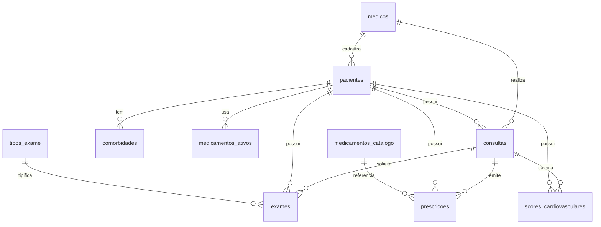

# BANCO_DADOS.md — Arquitetura de Banco de Dados

**Projeto:** CardioPront  
**Atualizado em:** 2026-06-28  
**Banco identificado:** PostgreSQL (via Supabase)  
**Especificação de origem:** `Escopo_Tecnico_Plataforma_Consulta_Medica_IA_Arcane_Tecnologia.md` (Arcane Tecnologia, v1.0, 28/06/2026)

> **Observação importante:** O arquivo `prisma/schema.sql` contém DDL escrita para MySQL 8 (ENGINE InnoDB, `AUTO_INCREMENT`, `ENUM`, `BOOLEAN`). O banco em produção é **PostgreSQL** via Supabase. O schema foi adaptado manualmente no Supabase. Tipos como `ENUM` do MySQL foram mapeados para `text` com constraints no Postgres. A coluna `auth_user_id` e `senha_hash` foram adicionadas à tabela `medicos` no Supabase e não constam no `schema.sql` original.

---

## 1. Visão Geral

O banco de dados do CardioPront armazena dados de médicos, pacientes, consultas, exames, prescrições, escores cardiovasculares e catálogos (medicamentos e tipos de exame). A persistência é gerenciada pelo **Supabase** (PostgreSQL gerenciado) e acessada diretamente via cliente JS (`@supabase/supabase-js`) nas Route Handlers do Next.js.

O armazenamento de áudio de consultas é feito no **Supabase Storage** (bucket `consultation-audio`), com URL pública referenciada na coluna `audio_url` da tabela `consultas`.

---

## 2. Tecnologia e Ferramentas

- **Banco:** PostgreSQL (Supabase)
- **ORM:** Nenhum ORM em runtime. Cliente direto Supabase JS (`@supabase/supabase-js` v2)
- **Migration tool:** Scripts SQL manuais em `supabase/migrations/`
- **Seeds:** Scripts SQL manuais em `prisma/seed-drugs.sql` e `prisma/seed-exams.sql`
- **Ambiente local:** Supabase cloud (projeto compartilhado)
- **Ambiente produção:** Supabase cloud (mesmo projeto)
- **String de conexão:** `NÃO DOCUMENTAR VALORES SENSÍVEIS` — ver `.env.example`

---

## 3. Localização dos Arquivos de Banco

| Tipo | Caminho | Observação |
|---|---|---|
| DDL de referência | `prisma/schema.sql` | DDL MySQL 8 — referência, não executada diretamente no Supabase |
| Seed de medicamentos | `prisma/seed-drugs.sql` | 30+ medicamentos cardiovasculares |
| Seed de exames | `prisma/seed-exams.sql` | 24 tipos de exame cardiológico |
| Migration: constraints de auth | `supabase/migrations/20260628_tighten_medicos_auth_constraints.sql` | NOT NULL + unique index em `medicos` |
| Migration: bucket de áudio | `supabase/migrations/20260628_z_consultation_audio_storage.sql` | Cria bucket `consultation-audio` + policy de insert |
| Cliente de dados | `src/lib/db.ts` | Singleton Supabase com fallback hardcoded |
| Tipos TypeScript | `src/types/index.ts` | Interfaces de domínio espelham as tabelas |

---

## 4. Modelo Entidade-Relacionamento

---

## 5. Tabelas / Coleções

### `medicos`

**Finalidade:** Usuários do sistema (cardiologistas).  
**Arquivo/model relacionado:** `src/types/index.ts` (interface `Medico`), `src/lib/auth-session.ts` (`MedicoAuthRow`)  
**Migration de origem:** `prisma/schema.sql` (base) + `supabase/migrations/20260628_tighten_medicos_auth_constraints.sql` (constraints)

| Campo | Tipo | Obrigatório | Default | Chave | Observações |
|---|---|---|---|---|---|
| id | bigint (auto-increment) | Sim | — | PK | |
| auth_user_id | uuid | Sim | — | — | UUID gerado no cadastro, usado como identificador de sessão |
| nome | varchar(100) | Sim | — | — | |
| email | varchar(150) | Sim | — | Unique (lower) | Unique index em `lower(email)` |
| senha_hash | varchar(255) | Sim | — | — | Formato: `pbkdf2_sha256$210000$salt$derivedKey` |
| crm | varchar(20) | Sim | — | — | |
| crm_uf | varchar(2) | Sim | — | — | |
| especialidade | varchar(100) | Não | 'Cardiologia' | — | |
| telefone | varchar(20) | Não | NULL | — | |
| plano | enum/text | Não | 'trial' | — | Valores: `trial`, `essencial`, `profissional`, `clinica` |
| trial_fim | date | Não | NULL | — | Data de fim do trial (+14 dias no cadastro) |
| criado_em | timestamp | Não | now() | — | |
| atualizado_em | timestamp | Não | now() | — | Atualizado automaticamente |

**Relacionamentos:**
- `medicos` 1:N `pacientes` (via `medico_id`)
- `medicos` 1:N `consultas` (via `medico_id`)

**Índices:**
- `medicos_email_lower_key` — unique index em `lower(email)`
- `medicos_email_idx` — index em `email`

**Constraints:**
- `auth_user_id` NOT NULL (migration 20260628)
- `nome` NOT NULL (migration 20260628)
- `email` NOT NULL (migration 20260628)
- `crm` NOT NULL (migration 20260628)
- `crm_uf` NOT NULL (migration 20260628)
- `senha_hash` NOT NULL (migration 20260628)

---

### `pacientes`

**Finalidade:** Pacientes cadastrados pelos médicos.  
**Arquivo/model relacionado:** `src/types/index.ts` (interface `Paciente`)  
**Migration de origem:** `prisma/schema.sql`

| Campo | Tipo | Obrigatório | Default | Chave | Observações |
|---|---|---|---|---|---|
| id | bigint (auto-increment) | Sim | — | PK | |
| medico_id | bigint | Sim | — | FK → medicos(id) | |
| nome | varchar(100) | Sim | — | — | |
| nascimento | date | Sim | — | — | |
| sexo | enum/text | Não | NULL | — | Valores: `M`, `F`, `O` |
| cpf | varchar(14) | Não | NULL | Unique | |
| telefone | varchar(20) | Não | NULL | — | |
| email | varchar(150) | Não | NULL | — | |
| tipo_sanguineo | enum/text | Não | NULL | — | Valores: `A+`, `A-`, `B+`, `B-`, `AB+`, `AB-`, `O+`, `O-` |
| peso_kg | decimal(5,1) | Não | NULL | — | |
| altura_cm | decimal(5,1) | Não | NULL | — | |
| alergias | text | Não | NULL | — | |

**Relacionamentos:**
- `pacientes` N:1 `medicos` (via `medico_id`)
- `pacientes` 1:N `comorbidades` (via `paciente_id`)
- `pacientes` 1:N `medicamentos_ativos` (via `paciente_id`)
- `pacientes` 1:N `consultas` (via `paciente_id`)
- `pacientes` 1:N `exames` (via `paciente_id`)
- `pacientes` 1:N `prescricoes` (via `paciente_id`)
- `pacientes` 1:N `scores_cardiovasculares` (via `paciente_id`)

---

### `comorbidades`

**Finalidade:** Condições/comorbidades dos pacientes.  
**Arquivo/model relacionado:** NÃO IDENTIFICADO (sem interface TypeScript dedicada)  
**Migration de origem:** `prisma/schema.sql`

| Campo | Tipo | Obrigatório | Default | Chave | Observações |
|---|---|---|---|---|---|
| id | bigint (auto-increment) | Sim | — | PK | |
| paciente_id | bigint | Sim | — | FK → pacientes(id) | |
| condicao | varchar(200) | Sim | — | — | |
| codigo_ciap2 | varchar(10) | Não | NULL | — | Código CIAP-2 |
| data_diagnostico | date | Não | NULL | — | |
| observacoes | text | Não | NULL | — | |
| ativa | boolean | Não | TRUE | — | |

**Status:** Tabela definida no schema mas **sem CRUD ou API implementada** — A CONFIRMAR se é usada.

---

### `medicamentos_ativos`

**Finalidade:** Medicamentos em uso pelo paciente.  
**Arquivo/model relacionado:** NÃO IDENTIFICADO (sem interface TypeScript dedicada)  
**Migration de origem:** `prisma/schema.sql`

| Campo | Tipo | Obrigatório | Default | Chave | Observações |
|---|---|---|---|---|---|
| id | bigint (auto-increment) | Sim | — | PK | |
| paciente_id | bigint | Sim | — | FK → pacientes(id) | |
| medicamento | varchar(200) | Sim | — | — | |
| dose | varchar(50) | Não | NULL | — | |
| frequencia | varchar(100) | Não | NULL | — | |
| data_inicio | date | Não | NULL | — | |
| data_fim | date | Não | NULL | — | |
| ativo | boolean | Não | TRUE | — | |
| observacoes | text | Não | NULL | — | |

**Status:** Tabela definida no schema mas **sem CRUD ou API implementada** — A CONFIRMAR se é usada.

---

### `consultas`

**Finalidade:** Registro de consultas cardiológicas.  
**Arquivo/model relacionado:** `src/types/index.ts` (interface `Consulta`)  
**Migration de origem:** `prisma/schema.sql`

| Campo | Tipo | Obrigatório | Default | Chave | Observações |
|---|---|---|---|---|---|
| id | bigint (auto-increment) | Sim | — | PK | |
| paciente_id | bigint | Sim | — | FK → pacientes(id) | |
| medico_id | bigint | Sim | — | FK → medicos(id) | |
| data_consulta | timestamp | Sim | — | — | |
| tipo | enum/text | Não | 'presencial' | — | Valores: `presencial`, `tele`, `retorno` |
| motivo_consulta | text | Não | NULL | — | |
| queixa_principal | text | Não | NULL | — | |
| historia_doenca_atual | text | Não | NULL | — | |
| historia_familiar_cardiovascular | text | Não | NULL | — | |
| pa_sistolica | int | Não | NULL | — | Pressão arterial sistólica |
| pa_diastolica | int | Não | NULL | — | Pressão arterial diastólica |
| fc | int | Não | NULL | — | Frequência cardíaca |
| fr | int | Não | NULL | — | Frequência respiratória |
| temp_celsius | decimal(4,1) | Não | NULL | — | Temperatura |
| saturacao_o2 | int | Não | NULL | — | Saturação de O₂ |
| peso_kg | decimal(5,1) | Não | NULL | — | |
| altura_cm | decimal(5,1) | Não | NULL | — | |
| imc | decimal(4,1) | Não | NULL | — | Calculado no backend ao salvar |
| exame_fisico_geral | text | Não | NULL | — | |
| diagnostico | text | Não | NULL | — | |
| cid10 | varchar(10) | Não | NULL | — | |
| conduta | text | Não | NULL | — | |
| orientacoes | text | Não | NULL | — | |
| audio_url | varchar(500) | Não | NULL | — | URL pública no Supabase Storage |
| transcricao_completa | text | Não | NULL | — | Texto retornado pelo Whisper |
| sintese_ia | jsonb | Não | NULL | — | Objeto estruturado (ConsultationAIDraft) |
| criado_em | timestamp | Não | now() | — | |

**Relacionamentos:**
- `consultas` N:1 `pacientes` (via `paciente_id`)
- `consultas` N:1 `medicos` (via `medico_id`)
- `consultas` 1:N `exames` (via `consulta_id`)
- `consultas` 1:N `prescricoes` (via `consulta_id`)
- `consultas` 1:N `scores_cardiovasculares` (via `consulta_id`)

**Regras importantes:**
- IMC é calculado no backend (`POST /api/consultas`) se `peso_kg` e `altura_cm` estiverem presentes.
- `sintese_ia` é armazenado como objeto JSON estruturado (não string).

---

### `tipos_exame`

**Finalidade:** Catálogo de tipos de exame.  
**Arquivo/model relacionado:** `src/types/index.ts` (interface `TipoExame`)  
**Migration de origem:** `prisma/schema.sql` + `prisma/seed-exams.sql`

| Campo | Tipo | Obrigatório | Default | Chave | Observações |
|---|---|---|---|---|---|
| id | bigint (auto-increment) | Sim | — | PK | |
| categoria | enum/text | Sim | — | — | Valores: `laboratorial`, `cardiovascular`, `imagem`, `outros` |
| nome | varchar(200) | Sim | — | — | |
| descricao | varchar(500) | Não | NULL | — | |
| codigo_tus | varchar(10) | Não | NULL | — | Código TUS |
| ativo | boolean | Não | TRUE | — | |

**Seed:** 24 tipos de exame (12 cardiovasculares, 9 laboratoriais, 3 imagem).

---

### `exames`

**Finalidade:** Exames pedidos em consultas.  
**Arquivo/model relacionado:** `src/types/index.ts` (interface `Exame`)  
**Migration de origem:** `prisma/schema.sql`

| Campo | Tipo | Obrigatório | Default | Chave | Observações |
|---|---|---|---|---|---|
| id | bigint (auto-increment) | Sim | — | PK | |
| consulta_id | bigint | Sim | — | FK → consultas(id) | |
| paciente_id | bigint | Sim | — | FK → pacientes(id) | |
| tipo_exame_id | bigint | Sim | — | FK → tipos_exame(id) | |
| prioridade | enum/text | Não | 'rotina' | — | Valores: `rotina`, `urgente`, `eletiva` |
| indicacao_clinica | text | Não | NULL | — | |
| data_pedido | date | Sim | — | — | |
| data_resultado | date | Não | NULL | — | |
| resultado_texto | text | Não | NULL | — | |
| resultado_valores | jsonb | Não | NULL | — | |
| status | enum/text | Não | 'pendente' | — | Valores: `pendente`, `resultado_enviado`, `lido` |

**Status:** Funcional para criação e listagem. Inserção de resultados (data_resultado, resultado_texto, resultado_valores) — A CONFIRMAR se há UI para isso.

---

### `prescricoes`

**Finalidade:** Prescrições emitidas em consultas.  
**Arquivo/model relacionado:** `src/types/index.ts` (interface `Prescricao`)  
**Migration de origem:** `prisma/schema.sql`

| Campo | Tipo | Obrigatório | Default | Chave | Observações |
|---|---|---|---|---|---|
| id | bigint (auto-increment) | Sim | — | PK | |
| consulta_id | bigint | Sim | — | FK → consultas(id) | |
| paciente_id | bigint | Sim | — | FK → pacientes(id) | |
| data_prescricao | date | Sim | — | — | |
| validade_dias | int | Não | 30 | — | |
| medicamento | varchar(200) | Sim | — | — | |
| principio_ativo | varchar(200) | Não | NULL | — | |
| dose | varchar(50) | Não | NULL | — | |
| unidade | varchar(20) | Não | NULL | — | |
| frequencia | varchar(100) | Não | NULL | — | |
| posologia | text | Não | NULL | — | |
| via | enum/text | Não | NULL | — | Valores: `oral`, `ev`, `im`, `sc`, `topica`, `inalatoria` |
| advertencias | text | Não | NULL | — | |

---

### `scores_cardiovasculares`

**Finalidade:** Escores cardiovasculares calculados em consultas.  
**Arquivo/model relacionado:** `src/lib/cardioScores.ts`  
**Migration de origem:** `prisma/schema.sql`

| Campo | Tipo | Obrigatório | Default | Chave | Observações |
|---|---|---|---|---|---|
| id | bigint (auto-increment) | Sim | — | PK | |
| consulta_id | bigint | Sim | — | FK → consultas(id) | |
| paciente_id | bigint | Sim | — | FK → pacientes(id) | |
| medico_id | bigint | Sim | — | — | Inserido via API mas não no schema original |
| tipo_score | enum/text | Sim | — | — | Valores: `CHA2DS2-VASc`, `HAS-BLED`, `Framingham`, `Killip`, `NYHA`, `EuroSCORE2` |
| valor | decimal(5,2) | Não | NULL | — | |
| risco | enum/text | Não | NULL | — | Valores: `baixo`, `moderado`, `alto`, `muito_alto` |
| calculado_em | timestamp | Não | now() | — | |

---

### `medicamentos_catalogo`

**Finalidade:** Catálogo de medicamentos cardiovasculares.  
**Arquivo/model relacionado:** `src/types/index.ts` (interface `MedicamentoCatalogo`)  
**Migration de origem:** `prisma/schema.sql` + `prisma/seed-drugs.sql`

| Campo | Tipo | Obrigatório | Default | Chave | Observações |
|---|---|---|---|---|---|
| id | bigint (auto-increment) | Sim | — | PK | |
| classe | varchar(100) | Sim | — | — | Ex: IECA, BRA, Beta-bloqueador, etc. |
| principio_ativo | varchar(200) | Sim | — | — | |
| nome_comercial | varchar(200) | Não | NULL | — | |
| apresentacao | varchar(100) | Não | NULL | — | |
| dose_padrao | varchar(50) | Não | NULL | — | |
| dose_maxima | decimal(8,2) | Não | NULL | — | |
| unidade | varchar(20) | Não | NULL | — | |
| via | enum/text | Não | NULL | — | Valores: `oral`, `ev`, `im`, `sc`, `topica`, `inalatoria` |
| ajuste_renal | boolean | Não | FALSE | — | Usado para alertas de ajuste renal |
| ajuste_hepatico | boolean | Não | FALSE | — | |
| principais_interacoes | text | Não | NULL | — | |
| contraindicacoes | text | Não | NULL | — | |
| ativo | boolean | Não | TRUE | — | |

**Seed:** 30 medicamentos cardiovasculares (anti-hipertensivos, anticoagulantes, antiagregantes, antiarrítmicos, estatinas, IC, vasodilatadores).

---

## 6. Migrações

| Ordem | Arquivo | Descrição | Status |
|---|---|---|---|
| 1 | `prisma/schema.sql` | DDL completo de todas as tabelas (referência MySQL) | Aplicado manualmente no Supabase |
| 2 | `prisma/seed-drugs.sql` | Seed de medicamentos cardiovasculares | A CONFIRMAR se executado |
| 3 | `prisma/seed-exams.sql` | Seed de tipos de exame | A CONFIRMAR se executado |
| 4 | `supabase/migrations/20260628_tighten_medicos_auth_constraints.sql` | Constraints NOT NULL em `medicos` + unique index em `lower(email)` | Aplicado |
| 5 | `supabase/migrations/20260628_z_consultation_audio_storage.sql` | Cria bucket `consultation-audio` + policy de insert para anon | Aplicado |

### Como rodar migrations
- As migrations em `supabase/migrations/` devem ser aplicadas manualmente no painel do Supabase (SQL Editor) ou via Supabase CLI.
- Os seeds em `prisma/` devem ser executados manualmente no Supabase após adaptação de sintaxe MySQL → PostgreSQL.

### Como reverter migrations
- Não há ferramenta de rollback automatizado.
- Reverter manualmente via SQL (ex: `DROP POLICY`, `DROP INDEX`).

### Cuidados
- **Nunca editar migration já aplicada em produção.** Criar nova migration corretiva.
- O `prisma/schema.sql` é DDL MySQL e pode divergir do schema real no PostgreSQL — tratar como referência, não como fonte de verdade.

---

## 7. Seeds e Dados Iniciais

### `prisma/seed-drugs.sql`
- **Tabela:** `medicamentos_catalogo`
- **Dados:** 30 medicamentos cardiovasculares em 10 classes (IECA, BRA, Bloqueador de Canais, Diurético, Beta-bloqueador, Anticoagulante, Antiagregante, Antiarrítmico, Estatina, IC, Vasodilatador, Nitrato).
- **Como executar:** Adaptar sintaxe MySQL → PostgreSQL e executar no SQL Editor do Supabase.

### `prisma/seed-exams.sql`
- **Tabela:** `tipos_exame`
- **Dados:** 24 tipos de exame (12 cardiovasculares, 9 laboratoriais, 3 imagem) com códigos TUS.
- **Como executar:** Adaptar sintaxe MySQL → PostgreSQL e executar no SQL Editor do Supabase.

### Usuários padrão
- Conta demo criada via `POST /api/bootstrap`:
  - E-mail: `demo@cardiopront.com.br`
  - Senha: `CardioDemo2026!`
  - CRM: `000000` / UF: `SP`
- **Não há seed de usuários administradores.**

---

## 8. Repositórios, Queries e Acesso a Dados

### Camada de acesso
- Não há camada de repository pattern. Todas as rotas de API acessam `supabaseAdmin` diretamente.
- `supabaseAdmin` é um singleton lazy em `src/lib/db.ts` que cria um cliente Supabase com URL e chave anon (com fallback hardcoded).

### Padrões usados
- **Filtro por médico:** Todas as queries de pacientes, consultas, exames e prescrições filtram por `medico_id` após resolver o médico via `auth_user_id`.
- **Join via select:** Supabase JS suporta joins via sintaxe `select("*, pacientes(nome)")`.
- **Count:** Usado `{ count: "exact", head: true }` para estatísticas do dashboard.

### Queries críticas
- **Detalhe do paciente** (`src/app/api/pacientes/[id]/route.ts`): 4 queries paralelas (paciente, consultas, exames, prescrições) com `Promise.all` e join de datas via `attachConsultationDates()`.
- **Dashboard stats** (`src/app/api/dashboard/stats/route.ts`): 3 counts paralelos + 1 query de IDs para filtrar exames por consulta.

### Pontos de performance
- Sem paginação nas listagens (pacientes, consultas, exames, prescrições) — risco de degradação com volume crescente.
- Sem cache de queries.
- Detalhe do paciente faz 4 queries sem índices otimizados além das PKs/FKs.

---

## 9. Índices e Performance

| Tabela | Índice | Campos | Motivo |
|---|---|---|---|
| medicos | medicos_email_lower_key | lower(email) (unique) | Login por e-mail case-insensitive |
| medicos | medicos_email_idx | email | Busca por e-mail |
| pacientes | (PK) | id | Identificação |
| pacientes | (FK) | medico_id | Filtro por médico |
| consultas | (PK) | id | Identificação |
| consultas | (FK) | paciente_id | Filtro por paciente |
| consultas | (FK) | medico_id | Filtro por médico |
| exames | (FK) | consulta_id | Filtro por consulta |
| exames | (FK) | paciente_id | Filtro por paciente |
| prescricoes | (FK) | consulta_id | Filtro por consulta |
| prescricoes | (FK) | paciente_id | Filtro por paciente |

### Índices sugeridos
| Tabela | Índice sugerido | Campos | Motivo |
|---|---|---|---|
| consultas | idx_consultas_medico_data | medico_id, data_consulta DESC | Listagem ordenada por data |
| exames | idx_exames_paciente_data | paciente_id, data_pedido DESC | Histórico por paciente |
| prescricoes | idx_prescricoes_paciente_data | paciente_id, data_prescricao DESC | Histórico por paciente |
| scores_cardiovasculares | idx_scores_paciente | paciente_id, calculado_em DESC | Histórico de escores |

---

## 10. Integridade, Constraints e Validações

### Foreign keys
- `pacientes.medico_id` → `medicos.id`
- `comorbidades.paciente_id` → `pacientes.id`
- `medicamentos_ativos.paciente_id` → `pacientes.id`
- `consultas.paciente_id` → `pacientes.id`
- `consultas.medico_id` → `medicos.id`
- `exames.consulta_id` → `consultas.id`
- `exames.paciente_id` → `pacientes.id`
- `exames.tipo_exame_id` → `tipos_exame.id`
- `prescricoes.consulta_id` → `consultas.id`
- `prescricoes.paciente_id` → `pacientes.id`
- `scores_cardiovasculares.consulta_id` → `consultas.id`
- `scores_cardiovasculares.paciente_id` → `pacientes.id`

### Unique constraints
- `medicos.email` (via unique index em `lower(email)`)
- `pacientes.cpf`

### Soft delete
- **Não implementado.** Registros são deletados fisicamente (se houver delete).

### Timestamps
- `medicos`: `criado_em`, `atualizado_em` (auto-update)
- `consultas`: `criado_em`
- `scores_cardiovasculares`: `calculado_em`

### Auditoria
- **Não implementada.** Não há tabela de auditoria ou log de alterações.

---

## 11. Segurança dos Dados

### Dados sensíveis
- **Dados de saúde** (LGPD aplicável): histórico de consultas, diagnósticos, prescrições, exames, escores.
- **Dados pessoais:** nome, CPF, e-mail, telefone, data de nascimento.
- **Credenciais:** `senha_hash` (PBKDF2-SHA256, 210.000 iterações).

### LGPD
- O projeto lida com dados de saúde — LGPD e CFM 1.821/2007 aplicáveis.
- **Não há mecanismo de anonimização** implementado.
- **Não há mecanismo de exportação/exclusão** de dados do paciente (direito do titular).

### Criptografia/hash
- Senhas: PBKDF2-SHA256 com salt aleatório.
- Dados em trânsito: HTTPS (Vercel + Supabase).
- Dados em repouso: Supabase gerencia (A CONFIRMAR se há criptografia ativa em repouso).

### Controle de acesso
- Isolamento por `medico_id` na camada de aplicação.
- **Sem RLS (Row Level Security)** no Supabase — segurança depende inteiramente da aplicação.

### RLS
- **Não implementado.** Recomendado ativar RLS no Supabase como camada adicional.

### Backups
- **Dependente do Supabase** — A CONFIRMAR política de backup.

### Logs
- `console.error` nas rotas de API — sem sistema de logs estruturado.

---

## 12. Pendências e Riscos

| Item | Risco | Severidade | Ação recomendada |
|---|---|---|---|
| Sem RLS no Supabase | Vazamento de dados se aplicação for comprometida | Alta | Ativar RLS com policy por `medico_id` |
| Bucket `consultation-audio` público | Qualquer um com URL acessa áudio de consulta | Alta | Tornar bucket privado + URLs assinadas |
| Sem paginação nas listagens | Degradação de performance com volume | Média | Implementar paginação com `range()` |
| Schema SQL em MySQL mas banco em Postgres | Divergências de tipos/sintaxe | Média | Criar DDL PostgreSQL canônico |
| Tabelas `comorbidades` e `medicamentos_ativos` sem API | Funcionalidade incompleta | Média | Implementar CRUD ou remover do schema |
| Sem auditoria/log de alterações | Impossível rastrear quem alterou o quê | Média | Criar tabela de auditoria |
| Sem mecanismo LGPD de exclusão/exportação | Não conformidade com LGPD | Alta | Implementar exclusão e exportação de dados |
| `medico_id` em `scores_cardiovasculares` não está no schema SQL | Inconsistência entre schema e runtime | Baixa | Atualizar schema SQL |
| Seeds em sintaxe MySQL | Pode falhar ao executar no Postgres | Baixa | Adaptar seeds para PostgreSQL |
| Sem tabela de Usuários (separada de médicos) | Spec sugere separação usuário/médico | Baixa | Avaliar refactor ou manter modelo unificado |
| Sem tabela de Clínicas | Spec solicita cadastro de clínica e segregação | Alta | Criar tabela `clinicas` + FK |
| Sem tabela de Gravações (separada) | Spec sugere entidade própria para gravações | Baixa | Avaliar extração de `audio_url` para tabela própria |
| Sem tabela de Transcrições (separada) | Spec sugere entidade própria com modelo e confiança | Baixa | Avaliar extração para tabela própria |
| Sem tabela de Documentos | Spec solicita histórico de documentos gerados | Média | Criar tabela `documentos` |
| Sem tabela de Logs de Auditoria | Spec solicita logs de acesso e alteração | Alta | Criar tabela `logs_auditoria` |
| Sem tabela de Consentimentos | Spec solicita registro de consentimento do paciente | Alta | Criar tabela `consentimentos` |
| Sem campo `aprovado_pelo_medico` em prescrições | Spec solicita aprovação formal | Alta | Adicionar coluna booleana |
| Sem campo `aprovado_pelo_medico` em exames | Spec solicita aprovação formal | Alta | Adicionar coluna booleana |
| Sem campo endereço em pacientes | Spec solicita endereço do paciente | Média | Adicionar coluna |
| Sem campo convênio em pacientes | Spec solicita convênio | Baixa | Adicionar coluna |
| Sem campos duração e quantidade em prescrições | Spec solicita duração e quantidade | Média | Adicionar colunas |
| Sem criptografia de dados sensíveis no banco | Spec solicita criptografia no banco | Alta | Avaliar pgcrypto ou app-level |
| Sem política de retenção de áudios | Spec solicita política de retenção | Alta | Definir regra e implementar purge |
| Sem 2FA | Spec sugere autenticação em dois fatores | Média | Avaliar TOTP |

---

## 13. Entidades do Escopo Técnico Não Implementadas

O Escopo Técnico (Arcane Tecnologia) especifica entidades que não existem no schema atual. Esta seção documenta cada entidade sugerida para planejamento futuro.

### 13.1. `usuarios`

**Finalidade:** Usuários do sistema separados da entidade médico.  
**Status:** Não implementado — `medicos` absorve o conceito de usuário.

| Campo sugerido | Tipo | Observação |
|---|---|---|
| id | bigint/uuid | PK |
| nome | varchar | |
| email | varchar | Unique |
| senha_hash | varchar | |
| perfil | enum/text | médico, secretaria, admin_clinica, admin_sistema |
| clinica_id | bigint | FK → clinicas |
| status | enum/text | ativo, inativo |
| criado_em | timestamp | |

### 13.2. `clinicas`

**Finalidade:** Cadastro de clínicas/consultórios para segregação multi-médico.  
**Status:** Não implementado.

| Campo sugerido | Tipo | Observação |
|---|---|---|
| id | bigint/uuid | PK |
| nome | varchar | |
| cnpj | varchar | Unique |
| endereco | text | |
| telefone | varchar | |
| logo | varchar | URL |
| configuracoes | jsonb | |
| criado_em | timestamp | |

### 13.3. `gravacoes`

**Finalidade:** Entidade própria para gravações de áudio (separada de consultas).  
**Status:** Não implementado — áudio é coluna `audio_url` em `consultas`.

| Campo sugerido | Tipo | Observação |
|---|---|---|
| id | bigint/uuid | PK |
| consulta_id | bigint | FK → consultas |
| arquivo_audio | varchar | URL no Storage |
| duracao | int | Segundos |
| status_processamento | enum/text | pendente, processado, erro |
| data_upload | timestamp | |
| hash_arquivo | varchar | Hash para integridade |

### 13.4. `transcricoes`

**Finalidade:** Entidade própria para transcrições (separada de consultas).  
**Status:** Não implementado — transcrição é coluna `transcricao_completa` em `consultas`.

| Campo sugerido | Tipo | Observação |
|---|---|---|
| id | bigint/uuid | PK |
| consulta_id | bigint | FK → consultas |
| texto_transcrito | text | |
| modelo_utilizado | varchar | Ex: whisper-1 |
| data_processamento | timestamp | |
| confianca_estimada | decimal | 0.0 a 1.0 |

### 13.5. `documentos`

**Finalidade:** Histórico de documentos gerados (receitas, pedidos, resumos, etc.).  
**Status:** Não implementado.

| Campo sugerido | Tipo | Observação |
|---|---|---|
| id | bigint/uuid | PK |
| consulta_id | bigint | FK → consultas |
| tipo | enum/text | receita, pedido_exame, resumo, orientacoes, encaminhamento, relatorio |
| conteudo | jsonb | |
| pdf_url | varchar | URL do PDF no Storage |
| status | enum/text | rascunho, aprovado, gerado |
| data_geracao | timestamp | |
| aprovado_por | bigint | FK → medicos |

### 13.6. `logs_auditoria`

**Finalidade:** Logs de acesso e alteração para trilha de auditoria.  
**Status:** Não implementado.

| Campo sugerido | Tipo | Observação |
|---|---|---|
| id | bigint/uuid | PK |
| usuario_id | bigint | FK → medicos/usuarios |
| acao | varchar | Ex: create, update, delete, login |
| entidade | varchar | Ex: consulta, paciente, prescricao |
| entidade_id | bigint | ID do registro afetado |
| data | timestamp | |
| ip | varchar | IP do usuário |
| detalhes | jsonb | Dados antes/depois |

### 13.7. `consentimentos`

**Finalidade:** Registro de consentimento do paciente para gravação e uso de IA.  
**Status:** Não implementado.

| Campo sugerido | Tipo | Observação |
|---|---|---|
| id | bigint/uuid | PK |
| paciente_id | bigint | FK → pacientes |
| tipo | enum/text | gravacao, uso_ia |
| versao_termo | varchar | Versão do termo aceito |
| aceito_em | timestamp | |
| forma_aceite | varchar | Ex: digital, verbal, assinado |
